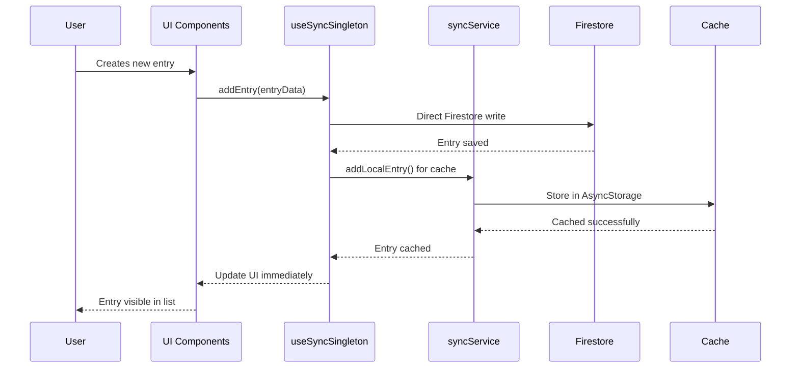
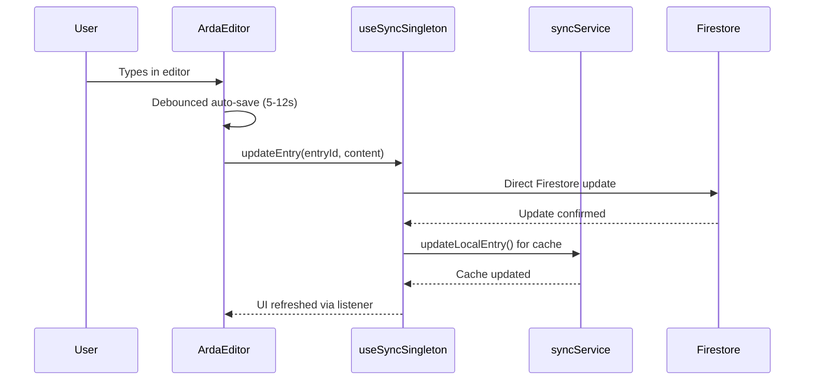
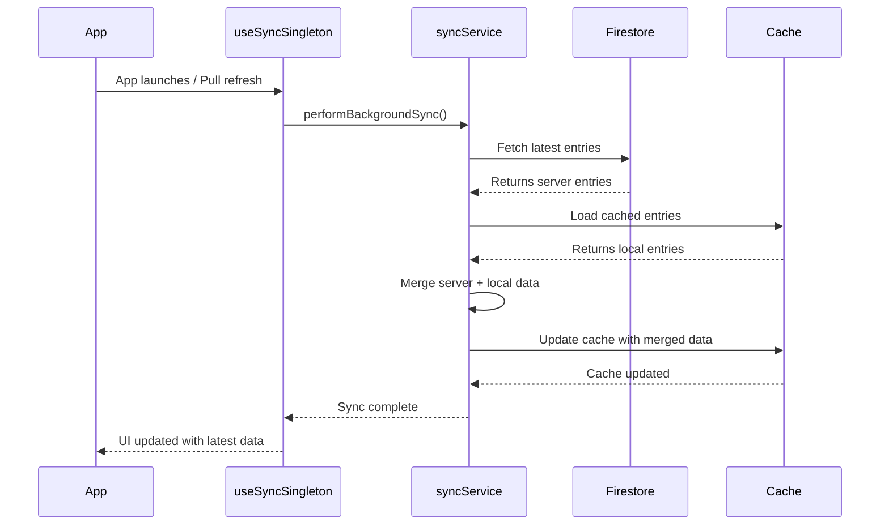

# Notes System Technical Documentation

## Table of Contents
1. [Overview](#overview)
2. [Architecture](#architecture)
3. [Data Flow](#data-flow)
4. [Core Components](#core-components)
5. [Data Models](#data-models)
6. [Editor System](#editor-system)
7. [Sync & Persistence](#sync--persistence)
8. [Navigation Flow](#navigation-flow)
9. [UI/UX Implementation](#uiux-implementation)
10. [Performance Optimizations](#performance-optimizations)
11. [Error Handling](#error-handling)
12. [Future Enhancements](#future-enhancements)

## Overview

The Notes System in ReflectaLab is a sophisticated journal entry management system built for React Native with Expo. It provides a native iOS-like experience for creating, editing, and managing personal reflection entries with real-time sync capabilities.

### Key Features
- **Native Text Editing**: Rich text editor with Apple Notes-like behavior
- **Offline-First Architecture**: Works seamlessly without internet connection
- **Real-time Sync**: Automatic synchronization with Firestore backend
- **Intelligent Auto-save**: Smart content persistence with debounced saves
- **Voice Transcription**: Audio-to-text conversion for voice notes
- **Gesture-based Navigation**: Swipe gestures for creating new entries
- **Optimistic Updates**: Immediate UI feedback with background sync

## Architecture

The Notes System follows a layered architecture with clear separation of concerns:

```
┌─────────────────────────────────────────┐
│              UI Layer                   │
│  ┌─────────────┐  ┌─────────────────┐   │
│  │ NotesScreen │  │  NewNote (Editor)│  │
│  │   (List)    │  │     Screen      │   │
│  └─────────────┘  └─────────────────┘   │
└─────────────────────────────────────────┘
┌─────────────────────────────────────────┐
│           Components Layer              │
│  ┌─────────────┐  ┌─────────────────┐   │
│  │  NoteCard   │  │   ArdaEditor    │   │
│  │ Component   │  │   Component     │   │
│  └─────────────┘  └─────────────────┘   │
└─────────────────────────────────────────┘
┌─────────────────────────────────────────┐
│            Hooks Layer                  │
│  ┌─────────────┐  ┌─────────────────┐   │
│  │useSyncSingle│  │ useAudioTranscr │   │
│  │    ton      │  │     iption      │   │
│  └─────────────┘  └─────────────────┘   │
└─────────────────────────────────────────┘
┌─────────────────────────────────────────┐
│          Services Layer                 │
│  ┌─────────────┐  ┌─────────────────┐   │
│  │ syncService │  │ coachingService │   │
│  │             │  │                 │   │
│  └─────────────┘  └─────────────────┘   │
└─────────────────────────────────────────┘
┌─────────────────────────────────────────┐
│         Persistence Layer               │
│  ┌─────────────┐  ┌─────────────────┐   │
│  │AsyncStorage │  │   Firestore     │   │
│  │   (Cache)   │  │   (Backend)     │   │
│  └─────────────┘  └─────────────────┘   │
└─────────────────────────────────────────┘
```

## Data Flow

### 1. Entry Creation Flow


### 2. Entry Editing Flow


### 3. Sync Flow


## Core Components

### NotesScreen.tsx
**Purpose**: Main notes list interface displaying all journal entries grouped by time periods.

**Key Features**:
- Time-based grouping (This week, Last 7 days)
- Pull-to-refresh functionality
- Skeleton loading states
- Entry preview generation
- Navigation to editor

**Props**: None (uses hooks for data)

**State Management**:
```typescript
const { entries: cachedEntries, isLoading, refreshEntries } = useSyncSingleton();
const [isRefreshing, setIsRefreshing] = useState(false);
```

**Data Processing**:
```typescript
// Transform cached entries to local format
const entries = useMemo<JournalEntry[]>(() => {
  return cachedEntries.map((e) => ({
    id: e.id,
    title: e.title,
    content: e.content,
    timestamp: e.timestamp,
    uid: e.uid,
  }));
}, [cachedEntries]);

// Group entries by time periods
const groupedEntries = useMemo(() => {
  const now = new Date();
  const today = new Date(now.getFullYear(), now.getMonth(), now.getDate());
  const weekAgo = new Date(today.getTime() - 7 * 24 * 60 * 60 * 1000);
  
  const thisWeek: JournalEntry[] = [];
  const last7Days: JournalEntry[] = [];
  
  entries.forEach(entry => {
    const entryDate = entry.timestamp.toDate ? 
      entry.timestamp.toDate() : new Date(entry.timestamp);
    const entryDateOnly = new Date(
      entryDate.getFullYear(), 
      entryDate.getMonth(), 
      entryDate.getDate()
    );
    
    if (entryDateOnly >= today) {
      thisWeek.push(entry);
    } else if (entryDateOnly >= weekAgo) {
      last7Days.push(entry);
    }
  });
  
  return { thisWeek, last7Days };
}, [entries]);
```

### NewNote.tsx (HomeContent)
**Purpose**: Rich text editor for creating and editing journal entries with advanced features.

**Key Features**:
- Rich text editing with ArdaEditor
- Smart auto-save system
- Voice transcription integration
- Gesture-based new entry creation
- Keyboard-aware scrolling
- Save status indication

**State Management**:
```typescript
const [entry, setEntry] = useState('');
const [latestEntry, setLatestEntry] = useState<JournalEntry | null>(null);
const [saveStatus, setSaveStatus] = useState<SaveStatus>('saved');
const [isNewEntry, setIsNewEntry] = useState(false);
const [isKeyboardVisible, setIsKeyboardVisible] = useState(false);
```

**Auto-save Implementation**:
```typescript
const handleContentChange = useCallback((newContent: string) => {
  setEntry(newContent);
  
  // Clear existing timeout
  if (saveTimeoutRef.current) {
    clearTimeout(saveTimeoutRef.current);
  }
  
  // Smart delay based on content length difference
  const contentDiff = Math.abs(trimmedNew.length - trimmedLast.length);
  const isSignificantChange = contentDiff >= 10;
  const delay = isSignificantChange ? 5000 : 12000;
  
  saveTimeoutRef.current = setTimeout(() => {
    if (trimmedNew && trimmedNew !== lastSavedContentRef.current.trim()) {
      saveEntry(newContent);
    }
  }, delay);
}, [saveEntry]);
```

### NoteCard.tsx
**Purpose**: Individual note card component for displaying note previews in the list.

**Props**:
```typescript
interface NoteCardProps {
  title: string;
  subtitle: string;
  preview: string;
  date?: string;
  onPress?: () => void;
}
```

**Visual Features**:
- Dark/light theme support
- Shadows and rounded corners
- Three-line preview with ellipsis
- Header with title and date
- Touch feedback

## Data Models

### JournalEntry (Firestore Document)
```typescript
interface JournalEntry {
  id: string;
  uid: string;                    // User ID
  content: string;                // HTML content
  timestamp: Date;                // Creation time
  lastUpdated: Date;              // Last modification time
  title?: string;                 // Optional title
  linkedCoachingSessionId?: string;   // AI coaching link
  linkedCoachingMessageId?: string;   // AI coaching message link
}
```

### CachedEntry (Local Storage)
```typescript
interface CachedEntry {
  id: string;
  title: string;
  content: string;
  timestamp: string;              // ISO string for JSON compatibility
  uid: string;
  linkedCoachingSessionId?: string;
  linkedCoachingMessageId?: string;
  lastUpdated?: string;
  _syncStatus: 'synced' | 'pending' | 'local-only';
  _lastSyncAttempt?: string;
}
```

### SyncState
```typescript
interface SyncState {
  lastSyncTime: string;
  syncInProgress: boolean;
  pendingUploads: string[];       // entry IDs
  failedSyncs: string[];
}
```

## Editor System

### ArdaEditor.tsx
**Purpose**: Advanced rich text editor component based on react-native-pell-rich-editor.

**Key Features**:
- HTML content editing
- Format toolbar integration
- Auto-focus and cursor management
- Voice transcription support
- AI coaching integration
- Keyboard-aware behavior

**Format Support**:
- **Bold**: `<b>`, `<strong>`
- **Italic**: `<i>`, `<em>`
- **Strikethrough**: `<s>`, `<del>`
- **Headings**: `<h1>`
- **Lists**: `<ul>`, `<ol>`
- **Quotes**: `<blockquote>`

**Editor Configuration**:
```typescript
editorStyle={{
  backgroundColor: colors.background,
  color: colors.text,
  fontSize: '16px',
  lineHeight: '24px',
  fontFamily: Platform.OS === 'ios' ? 'System' : 'Roboto',
  // Advanced CSS for text wrapping and input behavior
  cssText: `
    body { 
      margin: 0; 
      padding: 0; 
      word-wrap: break-word !important;
      -webkit-text-size-adjust: 100%;
    }
    [contenteditable="true"] {
      -webkit-line-break: after-white-space !important;
      autocorrect: on !important;
      spellcheck: true !important;
    }
  `,
}}
```

**Format Management**:
```typescript
const handleFormatText = useCallback((formatType: string) => {
  // Ensure editor has focus
  richTextRef.current.focusContentEditor?.();
  
  // Toggle format state for UI feedback
  setManualFormatState(prev => ({
    ...prev,
    [formatType]: !prev[formatType]
  }));
  
  // Execute formatting command
  switch (formatType) {
    case 'bold':
      editorAny?.sendAction?.(actions.setBold, 'result');
      break;
    case 'heading1':
      editorAny?.sendAction?.(actions.heading1, 'result');
      break;
    // ... other format types
  }
}, [manualFormatState]);
```

### KeyboardToolbar.tsx
**Purpose**: Floating toolbar for text formatting when keyboard is visible.

**Features**:
- Context-aware format buttons
- Active format highlighting
- Keyboard height detection
- Smooth animations

## Sync & Persistence

### syncService.ts
**Purpose**: Centralized service for managing data synchronization between local cache and Firestore.

**Key Capabilities**:
- **Offline-first architecture**: All operations work without internet
- **Optimistic updates**: Immediate UI feedback with background sync
- **Conflict resolution**: Smart merging of local and server data
- **Real-time sync**: Optional WebSocket-like updates
- **Error handling**: Graceful degradation and retry logic

**Cache Management**:
```typescript
async getCachedEntries(userId: string): Promise<CachedEntry[]> {
  const cached = await AsyncStorage.getItem(`@entries_cache_${userId}`);
  if (!cached) return [];
  
  const entries: CachedEntry[] = JSON.parse(cached);
  return entries.sort((a, b) => 
    new Date(b.timestamp).getTime() - new Date(a.timestamp).getTime()
  );
}

async setCachedEntries(userId: string, entries: CachedEntry[]): Promise<void> {
  // Deduplicate entries by ID
  const uniqueEntries = entries.reduce((acc, entry) => {
    const existingIndex = acc.findIndex(e => e.id === entry.id);
    if (existingIndex >= 0) {
      // Keep entry with most recent timestamp or better sync status
      const existing = acc[existingIndex];
      const entryTime = new Date(entry.timestamp).getTime();
      const existingTime = new Date(existing.timestamp).getTime();
      
      if (entryTime > existingTime || entry._syncStatus === 'synced') {
        acc[existingIndex] = entry;
      }
    } else {
      acc.push(entry);
    }
    return acc;
  }, [] as CachedEntry[]);
  
  await AsyncStorage.setItem(
    `@entries_cache_${userId}`, 
    JSON.stringify(uniqueEntries)
  );
}
```

**Sync Strategies**:

1. **Initial Sync**: Load from cache immediately, then sync with server
2. **Background Sync**: Periodic server sync with merge strategy
3. **Real-time Sync**: WebSocket-like updates (optional)
4. **Force Upload**: Upload all local-only entries to server

**Merge Strategy**:
```typescript
private async mergeEntries(
  userId: string, 
  firestoreEntries: CachedEntry[]
): Promise<CachedEntry[]> {
  const cachedEntries = await this.getCachedEntries(userId);
  const merged = new Map<string, CachedEntry>();
  
  // Add Firestore entries (source of truth for synced data)
  firestoreEntries.forEach(entry => {
    merged.set(entry.id, entry);
  });
  
  // Add local-only entries that haven't been synced yet
  cachedEntries.forEach(entry => {
    if (entry._syncStatus === 'local-only' || entry._syncStatus === 'pending') {
      merged.set(entry.id, entry);
    }
  });
  
  return Array.from(merged.values()).sort(
    (a, b) => new Date(b.timestamp).getTime() - new Date(a.timestamp).getTime()
  );
}
```

### useSyncSingleton.ts
**Purpose**: React hook providing global state management for notes with singleton pattern.

**Global State Management**:
```typescript
// Global state persists across component mounts
let globalEntries: CachedEntry[] = [];
let globalSyncStatus: SyncState = {
  lastSyncTime: new Date(0).toISOString(),
  syncInProgress: false,
  pendingUploads: [],
  failedSyncs: [],
};
let globalListeners: Set<() => void> = new Set();
```

**Hook Interface**:
```typescript
export interface UseSyncReturn {
  entries: CachedEntry[];
  syncStatus: SyncState;
  isLoading: boolean;
  error: string | null;
  refreshEntries: () => Promise<void>;
  addEntry: (entry: Omit<CachedEntry, 'id' | '_syncStatus'>) => Promise<string>;
  updateEntry: (entryId: string, updates: Partial<CachedEntry>) => Promise<void>;
  getEntryById: (entryId: string) => CachedEntry | undefined;
}
```

**Entry Operations**:
```typescript
const addEntry = useCallback(async (
  entry: Omit<CachedEntry, 'id' | '_syncStatus'>
): Promise<string> => {
  // Generate entry ID
  const entryId = Crypto.randomUUID();
  
  // Save directly to Firestore (immediate consistency)
  const entryRef = doc(db, 'journal_entries', entryId);
  await setDoc(entryRef, {
    uid: firebaseUser.uid,
    content: entry.content,
    timestamp: serverTimestamp(),
    title: entry.title || '',
    lastUpdated: serverTimestamp(),
  });
  
  // Also add to cache for offline access
  await syncService.addLocalEntry(firebaseUser.uid, {
    ...entry,
    id: entryId,
    _syncStatus: 'synced'
  });
  
  return entryId;
}, [firebaseUser?.uid]);
```

## Navigation Flow

### Navigation Structure
```
NotesNavigator (Stack)
├── NotesList (NotesScreen)
└── NewNote (HomeScreen)
```

### Navigation Parameters
```typescript
export type NotesStackParamList = {
  NotesList: undefined;
  NewNote: { 
    createNew?: boolean; 
    selectedEntry?: JournalEntry;
  } | undefined;
};
```

### Navigation Patterns

1. **List to Editor**: 
   ```typescript
   navigation.navigate('NewNote', { selectedEntry: entry });
   ```

2. **Create New Entry**:
   ```typescript
   navigation.navigate('NewNote', { createNew: true });
   ```

3. **Back Navigation with Auto-save**:
   ```typescript
   const navigateBack = async () => {
     // Force save before navigation
     if (currentContent && currentContent.length >= 1) {
       await saveEntry(entry);
     }
     navigation.goBack();
   };
   ```

## UI/UX Implementation

### Design Principles
- **Apple Notes-like Experience**: Native iOS design patterns
- **Minimal Interface**: Clean, distraction-free editing
- **Gesture-driven**: Swipe to create, pull to refresh
- **Immediate Feedback**: Optimistic updates and loading states

### Theme Support
```typescript
const colorScheme = useColorScheme();
const colors = Colors[colorScheme ?? 'light'];

// Dark theme compatibility
const cardStyle = {
  backgroundColor: isDark ? '#1F1F1F' : '#FFFFFF',
  borderColor: isDark ? '#374151' : '#D9D9D9',
  shadowColor: isDark ? '#000' : '#000',
  shadowOpacity: isDark ? 0.25 : 0.15,
};
```

### Loading States
```typescript
// Skeleton loading for initial load
const shouldShowSkeleton = isLoading && cachedEntries.length === 0;

{shouldShowSkeleton && (
  <>
    <View style={styles.sectionHeader}>
      <Skeleton style={{ width: 90, height: 12, borderRadius: 6 }} />
    </View>
    {Array.from({ length: 3 }).map((_, idx) => (
      <NoteCardSkeleton key={`s1-${idx}`} />
    ))}
  </>
)}
```

### Gesture Implementation
```typescript
// Swipe down to create new entry
const gestureHandler = useAnimatedGestureHandler({
  onActive: (event, context: any) => {
    const newTranslateY = Math.max(0, context.startY + event.translationY);
    translateY.value = newTranslateY;
    
    if (newTranslateY >= TRIGGER_THRESHOLD) {
      runOnJS(triggerHapticFeedback)();
    }
  },
  onEnd: () => {
    const shouldCreateEntry = translateY.value >= TRIGGER_THRESHOLD;
    translateY.value = withSpring(0);
    
    if (shouldCreateEntry) {
      runOnJS(createNewEntry)();
    }
  },
});
```

## Performance Optimizations

### 1. Memoization
```typescript
// Memoized entry transformation
const entries = useMemo<JournalEntry[]>(() => {
  return cachedEntries.map((e) => ({
    id: e.id,
    title: e.title,
    content: e.content,
    timestamp: e.timestamp,
    uid: e.uid,
  }));
}, [cachedEntries]);

// Memoized grouping
const groupedEntries = useMemo(() => {
  // Expensive grouping logic
}, [entries]);
```

### 2. Debounced Auto-save
```typescript
const handleContentChange = useCallback((newContent: string) => {
  // Clear existing timeout
  if (saveTimeoutRef.current) {
    clearTimeout(saveTimeoutRef.current);
  }
  
  // Smart delay based on content changes
  const delay = isSignificantChange ? 5000 : 12000;
  
  saveTimeoutRef.current = setTimeout(() => {
    saveEntry(newContent);
  }, delay);
}, [saveEntry]);
```

### 3. Singleton State Management
```typescript
// Global state prevents re-initialization across components
let globalEntries: CachedEntry[] = [];
let globalListeners: Set<() => void> = new Set();

// Efficient listener pattern
function notifyListeners() {
  globalListeners.forEach(listener => listener());
}
```

### 4. Efficient Cache Updates
```typescript
// Only notify on significant changes
if (!this.lastCacheLogCount || 
    Math.abs(sortedEntries.length - this.lastCacheLogCount) > 0) {
  console.log(`💾 Cached ${sortedEntries.length} unique entries`);
  this.lastCacheLogCount = sortedEntries.length;
}
```

## Error Handling

### 1. Network Failure Handling
```typescript
async performBackgroundSync(userId: string): Promise<void> {
  try {
    // Sync operations
  } catch (error) {
    console.error('❌ Background sync failed:', error);
    
    await this.setSyncState(userId, {
      ...syncState,
      syncInProgress: false,
      failedSyncs: [...syncState.failedSyncs, new Date().toISOString()],
    });
  } finally {
    this.syncInProgress = false;
  }
}
```

### 2. Editor Error Boundary
```typescript
<EditorErrorBoundary>
  <Editor
    ref={editorRef}
    content={entry}
    onUpdate={handleContentChange}
    // ... other props
  />
</EditorErrorBoundary>
```

### 3. Graceful Degradation
```typescript
// Fallback for missing entries
if (!querySnapshot.empty) {
  // Load from Firestore
} else {
  // Use local cache or empty state
  setLatestEntry(null);
  setEntry('');
}
```

### 4. Save Status Indicators
```typescript
const getSaveStatusIcon = () => {
  switch (saveStatus) {
    case 'saving':
      return <Loader2 size={18} color={iconColor} />;
    case 'unsaved':
      return <Loader2 size={18} color={iconColor} />;
    case 'saved':
    default:
      return <Check size={18} color={iconColor} />;
  }
};
```

## Future Enhancements

### 1. Enhanced Rich Text Features
- **Image Support**: Inline image embedding and management
- **Link Detection**: Automatic URL linkification
- **Tables**: Basic table creation and editing
- **Code Blocks**: Syntax highlighting for code snippets

### 2. Advanced Sync Features
- **Conflict Resolution UI**: Manual conflict resolution interface
- **Version History**: Track and restore previous versions
- **Collaborative Editing**: Real-time collaborative features
- **Cross-device Sync**: Seamless sync across multiple devices

### 3. AI Integration Improvements
- **Smart Suggestions**: AI-powered writing suggestions
- **Auto-categorization**: Automatic tagging and categorization
- **Sentiment Analysis**: Mood tracking and insights
- **Content Summarization**: Automatic entry summaries

### 4. Search and Organization
- **Full-text Search**: Search across all entries
- **Tag System**: Custom tags and filtering
- **Folders/Categories**: Hierarchical organization
- **Advanced Filters**: Date range, content type, mood filters

### 5. Export and Backup
- **PDF Export**: Export entries as formatted PDFs
- **Cloud Backup**: Additional backup services (Google Drive, iCloud)
- **Data Import**: Import from other journaling apps
- **API Access**: RESTful API for third-party integrations

### 6. Performance Optimizations
- **Virtual Scrolling**: For large entry lists
- **Background Sync**: More intelligent sync strategies
- **Image Optimization**: Automatic image compression
- **Caching Strategies**: Advanced caching with TTL

## Conclusion

The Notes System in ReflectaLab represents a sophisticated implementation of a modern journaling application with native-quality user experience. The architecture prioritizes offline functionality, real-time sync, and performance while maintaining a clean and intuitive interface.

The system's strength lies in its layered architecture, comprehensive error handling, and optimistic update patterns that ensure users never lose their work while providing immediate feedback for all interactions.

Future development should focus on enhancing the rich text capabilities, improving AI integration, and expanding the organizational features while maintaining the current performance and reliability standards.
